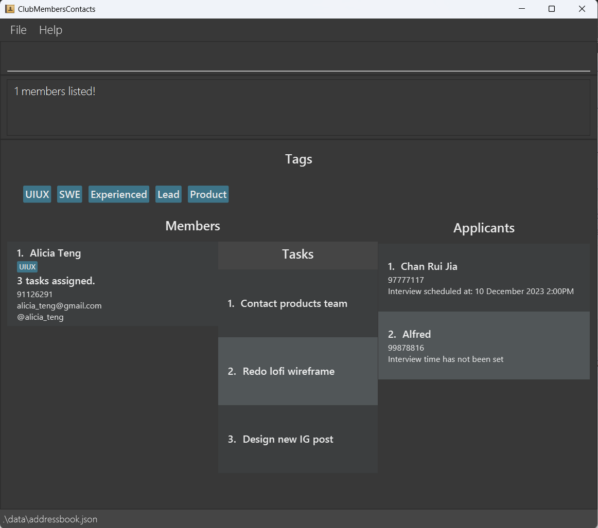
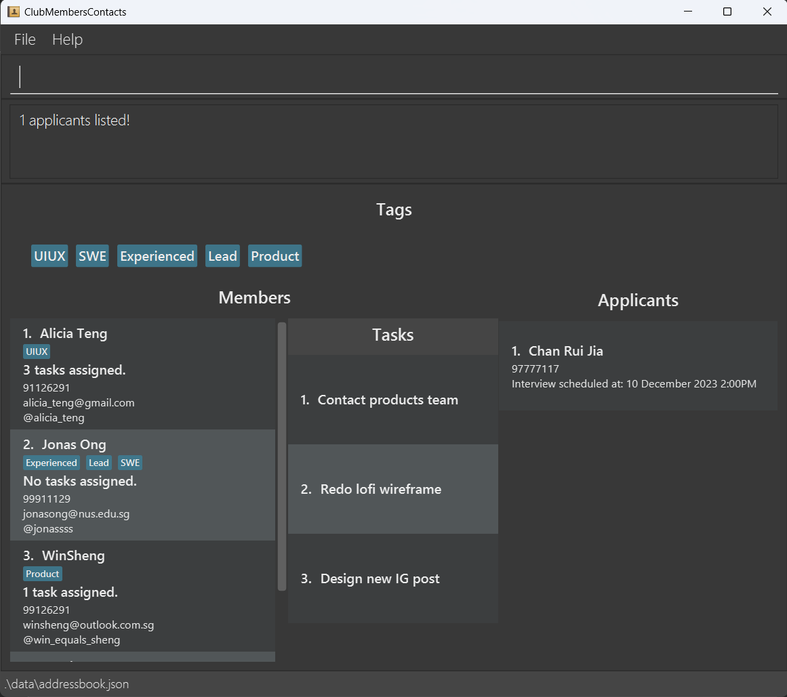
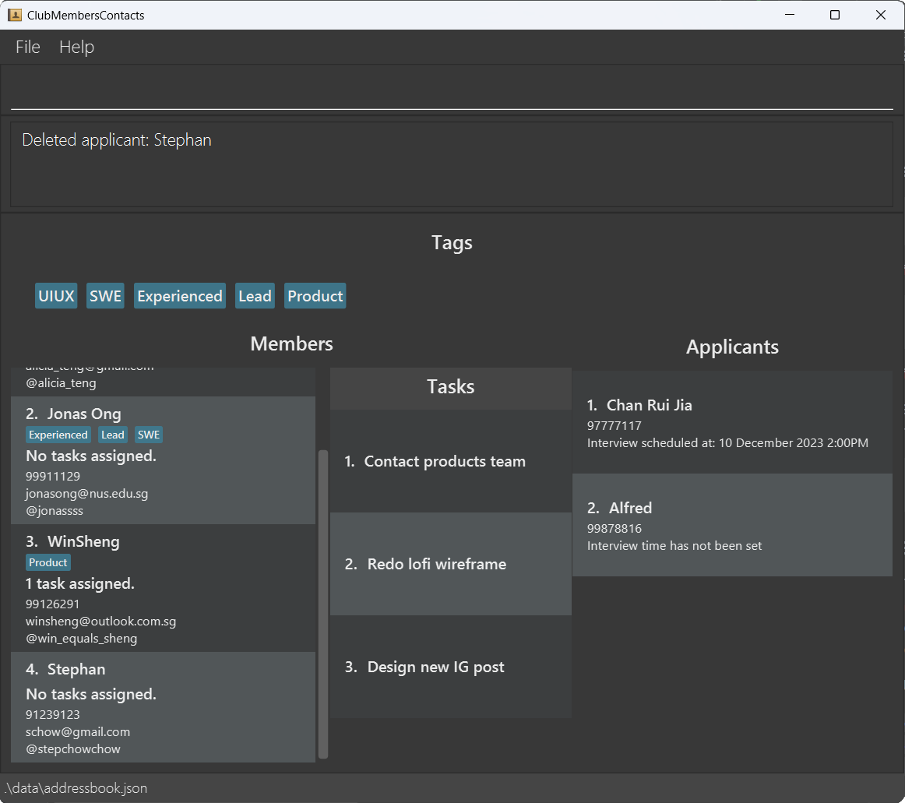

ClubMembersContacts (CMC) is an application designed to empower EXCO members of the School of Computing's CCAs in
efficiently managing the contacts of their members and applicants.

In the fast-paced world of CCA leadership, time is a precious resource, and effective contact management is crucial.
ClubMembersContacts has been tailored to cater to your specific needs, ensuring that you can streamline your
contact-related responsibilities seamlessly. It provides a swift and convenient yet powerful
solution through a Command Line Interface (CLI) aimed at optimizing the speed and effectiveness of your contact
management tasks.

Here are some possible ways you can integrate CMC into your CCA:

- You can add tags to different members to delegate them roles, or any additional information.
- You can track tasks assigned to each member to track their completion.
- You can schedule interview times with your applicants.
- You can find members or applicants easily through the `find` commands.

<div markdown="span" class="alert alert-primary">:bulb: **Tip:**

If this is your first time using CMC, head over to [How to use CMC's User Guide](#1-how-to-use-cmcs-user-guide)
to start keeping track of all your members and applicants!

</div>

--------------------------------------------------------------------------------------------------------------------

## Table of Contents

* Table of Contents
  {:toc}

--------------------------------------------------------------------------------------------------------------------

## 1. How to Use CMC's User Guide

Thank you for choosing to use CMC. We are sure that CMC will be your trusty companion throughout your
management journey. This user guide will provide you a comprehensive documentation of CMC's features.

If you are a first time user of CMC, make sure you have already downloaded the application. Head over to
[Quick Start](#2-quick-start) to learn how to install the application.

If you would like to have a brief introduction of the application's interface,
head over to our [Interface Walkthrough](#3-interface-walkthrough) to better learn about CMC.

If you are already a seasoned user of CMC, you can refer to [Command Summary](#6-command-summary) for a
quick reference to all the commands available in CMC.

## 2. Quick start

1. Ensure you have Java 11 or above installed in your Computer.

2. Download the latest ClubMembersContact.jar from [here](https://github.com/AY2324S1-CS2103T-W15-3/tp/releases).

3. Locate your jar file in your computer and double-click on it to run the application. Alternatively, you can run the
   jar file from the command line using the java -jar ClubMembersContact.jar command.

4. A GUI similar to the below should appear in a few seconds. Note how the app contains some sample data.<br>
   

5. Type the command in the command box and press Enter to execute it.
   Here are some example commands you can try:

    - `help`: Opens up the help window.
    - `addm /name Alicia Teng /phone 91126291 /email alicia_teng@gmail.com /tele @alicia_teng`: Adds a member
      named `Alicia Teng` to the member list. See how to [add applicant](#421-adding-an-applicant-addapplicant-or-adda)
      for more.
    - `adda /name Chan Rui Jia /phone 97777117 /interview 10/12/2023 1400`: Adds an applicant named `Chan Rui Jia` to
      the list. See how to [add member](#411-adding-a-member-addmember) for more.
    - `deltm 1`: Deletes the member at the 1st position on the member list.
    - `finda Win Sheng`: Searches for all applicants with `Win Sheng` in their contact details. See how
      to [find an applicant](#412-finding-members-findmember-or-findm) for more.
    - `editm 1 /tag Design`: Edits the tag of the member at the 3rd position on the member list. See how
      to [edit a member](#414-editing-a-member-editmember-or-editm) for more.
    - `exit`: Exits the application.

    <div markdown="span" class="alert alert-primary">:bulb: **Tip:**
    Follow each step in order to see how a normal workflow would feel like with CMC!
    </div>

6. Refer to the [Features](#4-features) below for details of each command.

<div markdown="span" class="alert alert-warning">:exclamation: **CAUTION:**
If you are using a PDF version of this User Guide, be careful when copy-pasting the commands that span beyond several lines. 
</div>
--------------------------------------------------------------------------------------------------------------------

## 3. Interface Walkthrough

This is the expected interface of the GUI when you launch CMC. Please note that this application has been populated
with sample data.

The key windows are labeled as follows:

1. File button: Opens an option to exit the application.
2. Help button: Opens a menu with a link to the User Guide.
3. Command Box: Enter your command here.
4. Result Display: Displays the result of your command.
5. Tag Display: Shows all the tags assigned to all members thus far.
6. Member List Display: Displays a list of all the members and their contact information.
7. Task List Display: Displays the task list assigned to a specific member.
8. Applicant List Display: Displays a list of all the applicants and their contact information.


The "Help" window will look like as follows:


--------------------------------------------------------------------------------------------------------------------

## 4. Features

This section of the User Guide will explain about each feature in detail.

<div markdown="block" class="alert alert-primary">

:information_source: **Notes about the inputs:**

* Commands are **case-insensitive**.

* Many of the commands below have _aliases_, or short-form versions that make them easier to type.  
  For example, the command `addMember` can be typed as `addm`. Usages of the aliases are documented below alongside the
  full command word, and all aliases can be used interchangeably with the full command word.

* Words in UPPER_CASE are input parameters that you need to provide for that specific field.  
  For example, in `addm /name NAME`, `NAME` would be the input parameter for the member's name.

* Fields in square brackets `[ ]` are optional fields.

* Parameters can be in any order.  
  For example, `adda /name Taylor Swift /phone 91961969` and `adda /phone 91691969 /name Taylor Swift` will result in
  the same applicant added.

* Items with … after them can be used multiple times including zero times.  
  For example, [tag/TAG]… can be used as (i.e. 0 times), tag/SWE, tag/UIUX tag/Product etc.

</div>

### 4.1 Member Features

These are all the features in regard to a member in CMC.

#### 4.1.1 Adding a member: `addMember`

Adds a member to the list of members in CMC.

- Use `addMember` or `addm` to use add a member
- Use `addApplicant` or `adda` to use add an applicant

#### Usage:

##### Adding member:

`addMember /name {memberName} /phone {phoneNumber} /email {email} /tele {telegramHandle} /tag {tag}`

`addm /name {memberName} /phone {phoneNumber} /email {email} /tele {telegramHandle} /tag {tag}`

#### Acceptable values for parameters:

- `name`: Only alphabetical characters, @, () are allowed
- `phoneNumber`: Only numbers are allowed
- `email`: Must follow the format of xyz@abc.wsd
- `telegramHandle`: Only alphanumeric characters and underscore are allowed
- `tag`: Only alphanumeric characters are allowed, tags are optional

#### Example of usage:

`addm /name John Doe /phone 92345678 /email johndoe@xyz.com /tele @johndoe /tag WelfareHead`

`adda /name John Doe /phone 92345678`

<div markdown="span" class="alert alert-primary">:bulb: **Tip:**
For a more efficient experience, use addm instead of addMember!
</div>

#### 4.1.2 Finding members: `findMember` or `findm`

Find and generate a list of all existing member(s) whose information contain any of the specified keyword(s).

##### Format:

`findMember KEYWORD...`  
`findm KEYWORD...`

<div markdown="span" class="alert alert-primary">
:information_source: **Notes about the command format:** KEYWORDs have to be separated by a space.
</div>

##### Example of usage:

- `findMember Alicia` or `findm Alicia`  
  This generates a list of all members whose details contain `Alicia`.

<div markdown="span" class="alert alert-primary">:bulb: **Tip:**
For a more efficient experience, use `findm` instead of `findMember`!
</div>

<div markdown="span" class="alert alert-primary">:bulb: **Tip:**

If you would like to go back to the whole list of members, use `viewm`.
You may check out the command [here](#413-viewing-members-viewmembers-or-view).

</div>



#### 4.1.3 Viewing members: `viewMembers` or `viewm`

Generates a list of all existing member(s). An example of where you might want to use this command is if
you want to go back to viewing all members after a search
with [`findMember`](#412-finding-members-findmember-or-findm).

##### Usage:

`viewMembers`
`viewm`

<div markdown="span" class="alert alert-primary">:bulb: **Tip:**
For a more efficient experience, use `viewm` instead of `viewMembers`!
</div>


#### 4.1.4 Editing a member: `editMember` or `editm`

#### 4.1.5 Deleting a member: `deleteMember` or `delm`

The member at the specified index will be deleted from the members list.

#### Usage:

`deleteMember {index}`

`delm {index}`

#### Acceptable values for parameters:

- `index`: Only numbers are allowed, starting from 1

#### Example of usage:

`deleteMember 1`

`delm 1`

#### Expected Outcome:

```
Deleted member: Alicia
```

#### If index is out of range:

```
The member index provided is invalid
```

#### If there are no members:

```
The member index provided is invalid
```

#### 4.1.6 Copying a member's details: `copyMember` or `cpm`

Copies the details of the member at the specified index to the clipboard.

##### Usage:

`copyMember {index}`
`cpm {index}`

<div markdown="span" class="alert alert-primary">

:information_source: **Notes about input parameter:** The input parameter will only take positive integers.
If the index is negative or 0, or the member does not exist in the list, this command will throw an error.
</div>

##### Example of usage:

`copyMember 1` or `cpm 1`: This copies the details of the member at index 1 to the clipboard.

{Image here}

The copied details will be as follows:

```
PLACEHOLDER
```

#### 4.1.7 Allocating a task to a member: `addTask` or `addt`

#### 4.1.8 Viewing all tasks allocated to a member: `viewTask` or `viewt`

#### 4.1.9 Deleting a task allocated to a member: `deleteTask` or `delt`

### 4.2 Applicant Features

#### 4.2.1 Adding an applicant: `addApplicant` or `adda`

#### 4.2.2 Finding applicants: `findApplicant` or `finda`

Find and generate a list of all existing applicants(s) whose information contain any of the specified keyword(s).

##### Format:

`findApplicant KEYWORD...`  
`finda KEYWORD...`

<div markdown="span" class="alert alert-primary">
:information_source: **Notes about the input parameter:** KEYWORDs have to be separated by a space.
</div>

##### Example of usage:

- `findApplicant Rui` or `finda Rui`  
  This generates a list of all members whose details contain `Rui`.


<div markdown="span" class="alert alert-primary">:bulb: **Tip:**
For a more efficient experience, use `finda` instead of `findApplicant`!
</div>

<div markdown="span" class="alert alert-primary">:bulb: **Tip:**

If you would like to go back to the whole list of members, use `viewa`.
You may check out the command [here](#423-viewing-applicants-viewapplicants-or-viewa)

</div>

#### 4.2.3 Viewing applicants: `viewApplicants` or `viewa`

Generates a list of all existing applicant(s). An example of where you might want to use this command is if
you want to go back to viewing all members after a search
with [`findApplicant`](#422-finding-applicants-findapplicant-or-finda).

##### Usage:

`viewApplicants`
`viewa`

<div markdown="span" class="alert alert-primary">:bulb: **Tip:**
For a more efficient experience, use `viewa` instead of `viewApplicants`!
</div>


#### 4.2.4 Editing an applicant: `editApplicant` or `edita`

The applicant at the specified index will have its specified fields edited. At least 1 field to be specified, not all
fields have to be specified.

#### Usage:

`editApplicant {index} /name {applicantName} /phone {phoneNumber} /interview {interviewTime}`

`edita {index} /name {applicantName} /phone {phoneNumber} /interview {interviewTime}`

#### Acceptable values for parameters:

- `index`: Only numbers are allowed, starting from 1
- `applicantName`: Only alphabetical characters, @, () are allowed
- `phoneNumber`: Only numbers are allowed
- `interviewTime`: Only dates in the format of "DD/MM/YYYY HhMm" are allowed. To remove an interview time from an
  applicant, 'cancel' is also allowed.

#### Example of usage:

`editApplicant 1 /name Alicia /phone 12345678 /interivew 12/10/2023 1400`

`edita 1 /name Alicia /phone 12345678 /interview 12/10/2023 1400`

#### Expected Outcome:

```
Edited applicant: Alicia
```

#### If name is invalid:

```
Names should only contain alphanumeric characters and spaces, and it should not be blank
```

#### If phone number is invalid:

```
Phone numbers should only contain numbers, and it should be at least 3 digits long
```

#### If interview date is invalid:

```
Interview time should be in the format of DD/MM/YYYY HHmm. 
To cancel the interview, enter 'cancel' (case sensitive)
```

#### 4.2.5 Deleting an applicant: `deleteApplicant` or `dela`

The applicant at the specified index will be deleted from the applicant list.

##### Format:

`deleteApplicant INDEX`  
`dela INDEX`

<div markdown="span" class="alert alert-warning">:exclamation: **CAUTION:**
This command is DESTRUCTIVE! This command cannot be undone. Deleted applicants will have to be readded into the list via
the addMember command. **Proceed with caution!**
</div>

<div markdown="span" class="alert alert-primary">

:information_source: **Notes about input parameter:** The input parameter will only take positive integers.
If the index is negative or 0, or the applicant does not exist in the list, this command will throw an error.
</div>

##### Example of usage:

- `deleteApplicant 3` or `dela 3`
  This deletes the applicant at index 1 in the applicant list.


<div markdown="span" class="alert alert-primary">:bulb: **Tip:**
For a more efficient experience, use `dela` instead of `deleteApplicant`!
</div>

#### 4.2.6 Copying a applicant's details: `copyApplicant` or `cpa`

Copies the details of the applicant at the specified index to the clipboard.

##### Usage:

`copyApplicant {index}`
`cpa {index}`

<div markdown="span" class="alert alert-primary">

:information_source: **Notes about input parameter:** The input parameter will only take positive integers.
If the index is negative or 0, or the applicant does not exist in the list, this command will throw an error.
</div>

##### Example of usage:

`copyApplicant 1` or `cpa 1`: This copies the details of the applicant at index 1 to the clipboard.

{Image here}

The copied details will be as follows:

```
PLACEHOLDER
```

### 4.3 General Features

#### 4.3.1 Accessing the user guide: `help`

Opens a window with a link to the user guide.
<div markdown="span" class="alert alert-primary">:bulb: **Tip:**

This window can also be opened from accessing the `Help` button.  
Check out the [Interface Walkthrough](#3-interface-walkthrough) to locate where the button is.

</div>

#### 4.3.2 Exiting the application: `exit`

Exits the application.

<div markdown="span" class="alert alert-warning">:exclamation: **CAUTION:**
There will be no prompt to confirm this action.
</div>

## 5. FAQ

Q: How do I see tasks of a different member?  
A: You have to use the `viewt` or `viewTask` method to view the tasks allocated to another member.  
For example, if your window is currently on another member's task, use `viewt 3` to view the tasks of the member at
index 3.

Q: How do I transfer my data to another person or computer?  
A: This application saves the data of your applicants and members in the ./data/addressbook.json file. You can send the
file to the other
person or computer, and overwrite the empty addressbook.json with addressbook.json file of your choice.

<div markdown="span" class="alert alert-warning">:exclamation: **CAUTION:**
If the addressbook.json file is invalid or has any formatting errors, the program might not start up. Please make sure that
the addressbook.json file used is **correct and accurate.**
</div>


--------------------------------------------------------------------------------------------------------------------

## 6. Command summary

| Action                      | Format                                                                                                                                                                                                         | Example(s)                                                                                                                                                                        |
|-----------------------------|----------------------------------------------------------------------------------------------------------------------------------------------------------------------------------------------------------------|-----------------------------------------------------------------------------------------------------------------------------------------------------------------------------------|
| **Add Member**              | `addMember /name NAME /phone PHONE_NUMBER /email EMAIL /tele TELEGRAM_HANDLE [/tag TAG]...`  <br/> <br/>  `addm /name NAME /phone PHONE_NUMBER /email EMAIL /tele TELEGRAM_HANDLE [/tag TAG]...`               | `addm /name Alicia /phone 92345678 /email alicia@gmail.com /tele @Alicia`  <br/> <br/> `addMember /name Jonas /phone 9993 3325 /email jonas@outlook.com /tele @jonasong /tag SWE` |
| **Delete Member**           | `deleteMember INDEX` <br/> <br/> `delm INDEX`                                                                                                                                                                  | `deleteMember 1` <br/> <br/> `delm 1`                                                                                                                                             |
| **Edit Member**             | `editMember INDEX [/name NAME] [/phone PHONE_NUMBER] [/email EMAIL] [/tele TELEGRAM_HANDLE] [/tag TAG]` <br/> <br/>`editm INDEX [/name NAME] [/phone PHONE] [/email EMAIL] [/tele TELEGRAM_HANDLE] [/tag TAG]` | `editm 1 /name Alicia /phone 99126291`  <br/> <br/> `editm 1 /email aliciateng@gmail.com`                                                                                         |
| **Find Member(s)**          | `findMember KEYWORD` <br/> <br/> `findm KEYWORD`                                                                                                                                                               | `findm Alicia` <br/> <br/> `findm John 92345678` <br/> <br/> `findMember Designer`                                                                                                |
| **View Member(s)**          | `viewMembers` <br/> <br/> `viewm`                                                                                                                                                                              | `viewMembers` <br/> <br/> `viewm`                                                                                                                                                 |
| **Add Applicant**           | `addApplicant /name [NAME] /phone PHONE_NUMBER` <br/> <br/> `adda /name NAME /phone PHONE_NUMBER`                                                                                                              | `addApplicant /name Jonas /phone 91238932` <br/> <br/> `adda /name Alicia /phone 92345678`                                                                                        |
| **Add Task to Member**      | `addTask [MEMBER_INDEX] /task [TASK_DESCRIPTION]` <br/> <br/> `addt [MEMBER_INDEX] /task [TASK_DESCRIPTION]`                                                                                                   | `addTask 2 /task Design Poster` <br/> <br/> `addt 3 /task Meet Product Team`                                                                                                      |
| **View Task(s) of Member**  | `viewTask [MEMBER_INDEX]` <br/> <br/> `viewt [MEMBER_INDEX]`                                                                                                                                                   | `viewTask 2` <br/> <br/> `viewt 5`                                                                                                                                                |
| **Delete Task from Member** | `deleteTask MEMBER_INDEX /task TASK_INDEX` <br/> <br/> `delt MEMBER_INDEX /task TASK_INDEX`                                                                                                                    | `deleteTask 2 /task 4` <br/> <br/> `delt 1 /task 10`                                                                                                                              |
| **Delete Applicant**        | `deleteApplicant INDEX` <br/> <br/> `dela INDEX`                                                                                                                                                               | `deleteApplicant 3` <br/> <br/> `dela 1`                                                                                                                                          |
| **Edit Applicant**          | `editApplicant INDEX [/name NAME] [/phone PHONE_NUMBER] [/interview INTERVIEW_TIME` <br/> <br/>  `edita INDEX [/name NAME] [/phone PHONE_NUMBER] [/interview INTERVIEW_TIME`                                   | `editApplicant 1 /name John` <br/> <br/> `edita 1 /interview 07/01/2003 1500` <br/><br/> `edita 1 /name Aliciaa /phone 12345678 /interview 10/12/2023 1150`                       |
| **Find Applicant(s)**       | `findApplicant KEYWORD...` <br/><br/> `finda KEYWORD...`                                                                                                                                                       | `finda Alicia` <br/><br/> `finda John 92345678`                                                                                                                                   |
| **View Applicant(s)**       | `viewApplicants` <br/><br/> `viewa`                                                                                                                                                                            | `viewApplicants` <br/><br/> `viewa`                                                                                                                                               |
