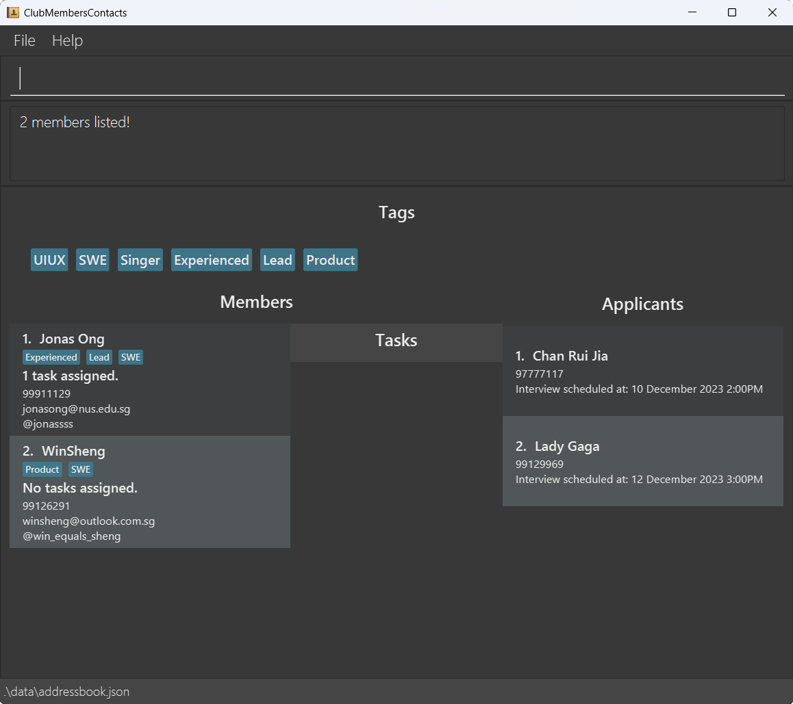
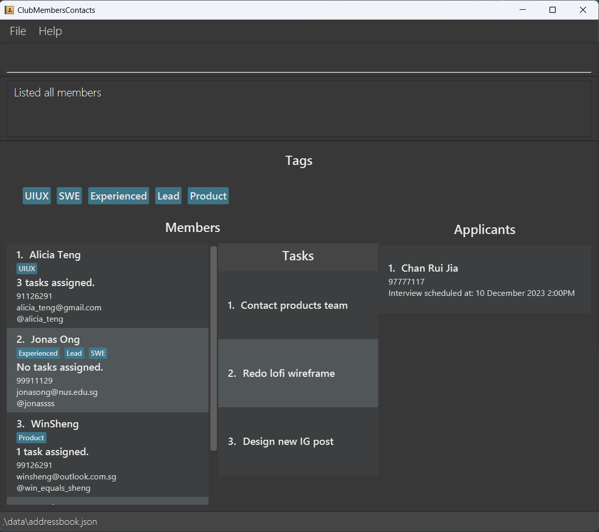
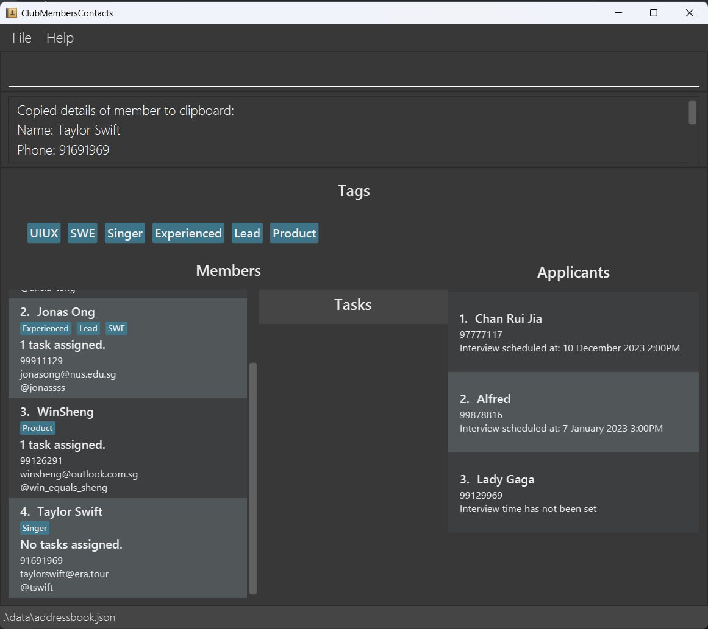
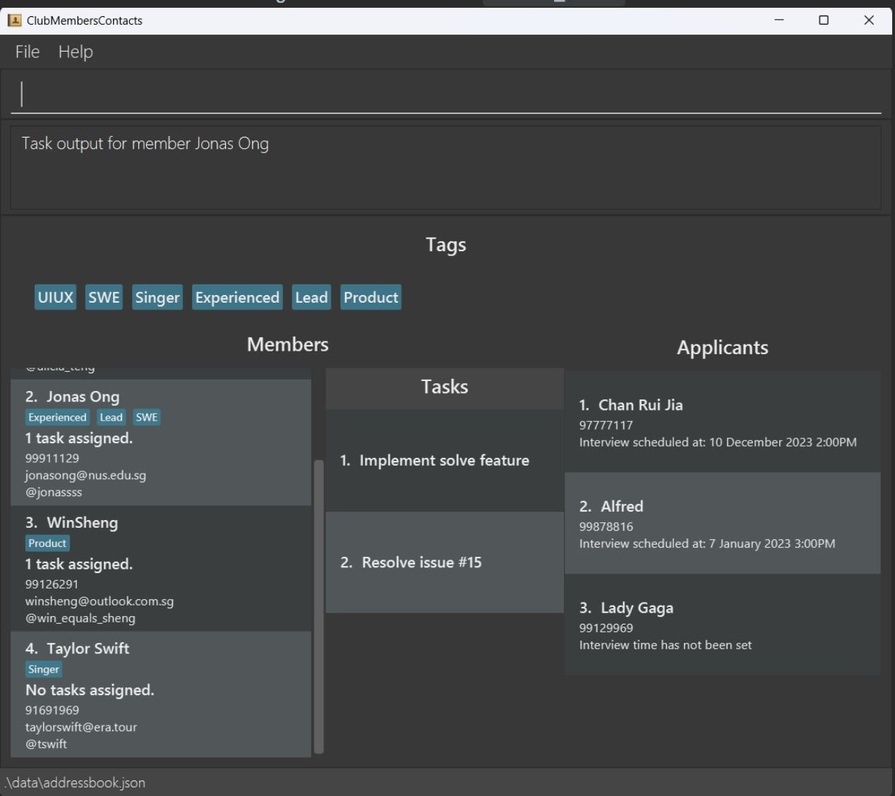
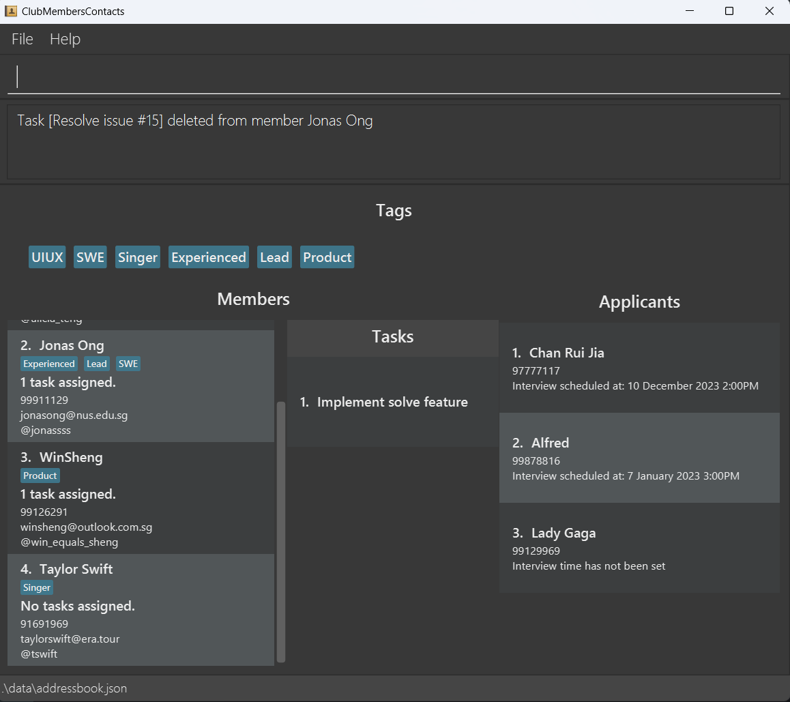
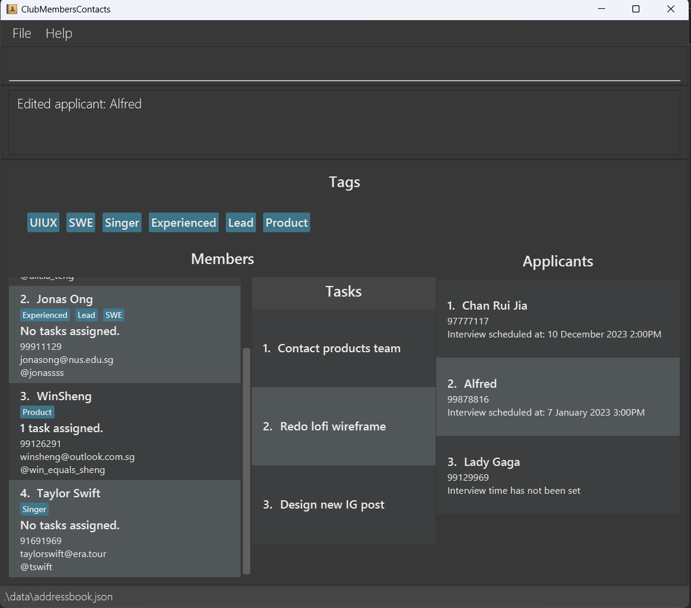

ClubMembersContacts (CMC) is an application designed to empower EXCO members of the School of Computing's CCAs in
efficiently managing the contacts of their members and applicants.

In the fast-paced world of CCA leadership, time is a precious resource, and effective contact management is crucial.
ClubMembersContacts has been tailored to cater to your specific needs, ensuring that you can streamline your
contact-related responsibilities seamlessly. It provides a swift and convenient yet powerful
solution through a Command Line Interface (CLI) aimed at optimizing the speed and effectiveness of your contact
management tasks.

Here are some possible ways you can integrate CMC into your CCA:

- You can add tags to different members to delegate them roles, or any additional information.
- You can track tasks assigned to each member to track their completion.
- You can schedule interview times with your applicants.
- You can find members or applicants easily through the `find` commands.

<div markdown="span" class="alert alert-info">:bulb: **Tip:**

If this is your first time using CMC, head over to [How to use CMC's User Guide](#1-how-to-use-cmcs-user-guide)
to start keeping track of all your members and applicants!

</div>

<div style="page-break-after: always;"></div>

<h2>Table of Contents</h2>

--------------------------------------------------------------------------------------------------------------------

* Table of Contents
{:toc}


--------------------------------------------------------------------------------------------------------------------

<div style="page-break-after: always;"></div>

## 1. How to Use CMC's User Guide

Thank you for choosing to use CMC. We are sure that CMC will be your trusty companion throughout your
management journey. This user guide will provide you a comprehensive documentation of CMC's features.

If you are a first time user of CMC, make sure you have already downloaded the application. Head over to
[Quick Start](#2-quick-start) to learn how to install the application.

If you would like to have a brief introduction of the application's interface,
head over to our [Interface Walkthrough](#3-interface-walkthrough) to better learn about CMC.

If you are already a seasoned user of CMC, you can refer to [Command Summary](#8-command-summary) for a
quick reference to all the commands available in CMC.

If you are facing any problems with the commands or are unsure of anything, you may refer to the [FAQ](#6-frequently-asked-questions-faqs) for common questions,
or refer to [Common Mistakes](#7-common-mistakes) for common errors our users may face while using the application.

<div style="page-break-after: always;"></div>

## 2. Quick start

1. Ensure you have Java 11 or above installed in your Computer.

2. Download the latest ClubMembersContact.jar from [here](https://github.com/AY2324S1-CS2103T-W15-3/tp/releases).

3. Locate your jar file in your computer and double-click on it to run the application. Alternatively, you can run the
   jar file from the command line using the `java -jar` ClubMembersContact.jar command.

4. A GUI similar to the below should appear in a few seconds. Note how the app contains some sample data.<br>

   

5. Type the command in the command box and press Enter to execute it.
   Here are some example commands you can try:

    - `help`: Opens up the help window.
    - `addm /name Alicia Teng /phone 91126291 /email alicia_teng@gmail.com /tele @alicia_teng`: Adds a member
      named `Alicia Teng` to the list of members. See how to [add member](#411-adding-a-member-addmember-or-addm)
      for more.
    - `adda /name Chan Rui Jia /phone 97777117 /interview 10/12/2023 1400`: Adds an applicant named `Chan Rui Jia` to
      the list. See how to [add applicant](#421-adding-an-applicant-addapplicant-or-adda) for more.
    - `delm 1`: Deletes the first member in the list of members.
    - `finda Win Sheng`: Searches for all applicants with `Win Sheng` in their contact details. See how
      to [find an applicant](#422-finding-applicants-findapplicant-or-finda) for more.
    - `editm 1 /tag Design`: Edits the tag of the first member in the list of members. See how
      to [edit a member](#414-editing-a-member-editmember-or-editm) for more.
    - `exit`: Exits the application.

        <div markdown="span" class="alert alert-info">:bulb: **Tip:**
        Follow each step in order to see how a normal workflow would feel like with CMC!
        </div>

6. Refer to the [Features](#4-features) below for details of each command.

<div markdown="span" class="alert alert-warning">:exclamation: **CAUTION:**
If you are using a PDF version of this User Guide, be careful when copy-pasting the commands that span beyond several lines. 
</div>
--------------------------------------------------------------------------------------------------------------------

<div style="page-break-after: always;"></div>

## 3. Interface Walkthrough

This is the expected interface of the GUI when you launch CMC. Please note that this application has been populated
with sample data.

The key windows are labeled as follows:

1. File button: Opens an option to exit the application.
2. Help button: Opens a menu with a link to the User Guide.
3. Command Box: Enter your command here.
4. Result Display: Displays the result of your command.
5. Tag Display: Shows all the tags assigned to all members thus far.
6. Member List Display: Displays a list of all the members and their contact information.
7. Task List Display: Displays the task list assigned to a specific member.
8. Applicant List Display: Displays a list of all the applicants and their contact information.


The "Help" window will look like as follows:


--------------------------------------------------------------------------------------------------------------------

<div style="page-break-after: always;"></div>

## 4. Features

This section of the User Guide will explain about each feature in detail.

<div markdown="block" class="alert alert-primary">

:information_source: **Notes about the inputs:**

* Commands are **case-insensitive**.

* Parameters can be in any order.  
  For example, `adda /name Taylor Swift /phone 91961969` and `adda /phone 91691969 /name Taylor Swift` will result in
  the same applicant added.

* Words in UPPER_CASE are input parameters that you need to provide for that specific field.  
  For example, in `addm /name NAME`, `NAME` would be the input parameter for the member's name.

* Parameters can be in any order.  
  For example, `adda /name Taylor Swift /phone 91961969` and `adda /phone 91691969 /name Taylor Swift` will result in
  the same applicant added.

* Items with … after them can be used multiple times (1 or more).  
  For example, the `findm KEYWORD` command can be used to search 1 `KEYWORD` like `findm SWE`, or 2 `KEYWORD`s like `findm SWE Product`.

* Fields in square brackets `[ ]` are optional fields.
  For example, `[/tag TAG]...` means the /tag parameter can be omitted, or used multiple times like `/tag SWE`, `/tag UIUX /tag Product`, etc.

* For commands that do not take input parameters (e.g. `help`, `exit`), any input parameters provided will be ignored.
  For example, `help /name Taylor Swift` is equivalent to `help` and will still open the help window.

* See [examples of fields](#58-examples-of-fields) for more examples of valid and invalid fields.

</div>

<div markdown="block" class="alert alert-info">

:bulb: **Aliases**

Many of the commands below have _aliases_, or short-form versions that make them easier to type (e.g. `addm`
for `addmember`).

The aliases are documented below alongside the full command. For a more efficient experience, use the aliases instead of
the full command word!

</div>

<div style="page-break-after: always;"></div>

### 4.1 Member Features

These are all the features in regard to a **member** in CMC.

#### 4.1.1 Adding a member: `addmember` or `addm`

Adds a member to the list of members.

<h5>Format</h5>

`addmember /name MEMBER_NAME /phone PHONE_NUMBER /email EMAIL /tele TELEGRAM_HANDLE [/tag TAG]...`<br/>
The alias for this command is `addm`.

<div markdown="block" class="alert alert-primary">

:information_source: **Notes about input parameter:**

* `MEMBER_NAME`: Only alphabetical characters, spaces, @, (), /, are allowed. This field should not be blank.
  <br/>
* `PHONE_NUMBER`: Only numbers are allowed. At least 3 digits are required.
  <br/>
* `EMAIL`: The email has to follow localpart@domain format. See [email format](#54-email-format) for more details.
  <br/>
* `TELEGRAM_HANDLE`: Starting character of @ is required. Only alphanumeric characters and underscore are allowed.
  Minimum of 5 and maximum of 32 characters are allowed.
  <br/>
* `TAG`: Only alphanumeric characters are allowed. Minimum of 1 and maximum of 15 characters are allowed. Spaces are not allowed.

</div>

<div markdown="block" class="alert alert-warning">:exclamation: **CAUTION:**

* For a new member to be created, the `PHONE_NUMBER` has to be unique.
  Otherwise, the system will reject this as a duplicate member.
  <br/>
* The last valid parameter found will treat all of the characters after it as its input.
  <br/>
  * Consider this command: `addm /name Taylor Swift /phone 91691969 /email taylorswift@era.tour /tele @tswift /invalid invalid`
  <br/>
  * The `tele` parameter will treat `@tswift /invalid invalid` as its input which is invalid.

</div>

<h5>Example of usage</h5>

`addm /name Taylor Swift /phone 91691969 /email taylorswift@era.tour /tele @tswift /tag Admin`

This adds a new member named `Taylor Swift` with phone number `91691969`, email `taylorswift@era.tour`, telegram
handle `@tswift` and tag `Admin` to the list of members.


<div style="page-break-after: always;"></div>

#### 4.1.2 Finding members: `findmember` or `findm`

Find and generate a list of all existing member(s) whose information contain any of the specified keyword(s).

<h5>Format</h5>

`findmember KEYWORD...`<br/>
The alias for this command is `findm`.

<div markdown="span" class="alert alert-primary">
:information_source: **Notes about the command format:** `KEYWORD`s have to be separated by a space.
</div>

<h5>Example of usage</h5>

`findm SWE Product`

This generates a list of all members whose details contain either `SWE` or `Product`.



<div markdown="span" class="alert alert-info">:bulb: **Tip:**

If you would like to go back to the whole list of members, use `viewmember`.
You may check out the command [here](#413-viewing-members-viewmembers-or-viewm).

</div>

<div style="page-break-after: always;"></div>

#### 4.1.3 Viewing members: `viewmembers` or `viewm`

Generates a list of all existing member(s). An example of where you might want to use this command is if
you want to go back to viewing all members after a search with [`findmember`](#412-finding-members-findmember-or-findm).

<h5>Format</h5>

`viewmembers`<br/>
The alias for this command is `viewm`.

<h5>Example of usage</h5>

`viewmembers`

Generates a list of all existing member(s).



<div style="page-break-after: always;"></div>

#### 4.1.4 Editing a member: `editmember` or `editm`

The member at the specified index will have his/her specified field(s) edited.

<h5>Format</h5>

`editmember MEMBER_INDEX [/name MEMBER_NAME] [/phone PHONE_NUMBER] [/email EMAIL] [/tele TELEGRAM_HANDLE] [/tag TAG]...`<br/>
The alias for this command is `editm`.

<div markdown="block" class="alert alert-primary">

:information_source: **Notes about input parameter:**

Even though all the fields are optional, **at least one field** has to be specified for the command to work.

* `MEMBER_NAME`: Only alphabetical characters, spaces, @, (), /, are allowed. This field should not be blank.
  <br/>
* `PHONE_NUMBER`: Only numbers are allowed. At least 3 digits are required.
  <br/>
* `EMAIL`: The email has to follow localpart@domain format. See [email format](#54-email-format) for more details.
  <br/>
* `TELEGRAM_HANDLE`: Starting character of @ is required. Only alphanumeric characters and underscore are allowed.
  Minimum of 5 and maximum of 32 characters are allowed.
  <br/>
* `TAG`: Only alphanumeric characters are allowed. Minimum of 1 and maximum of 15 characters are allowed. Spaces are not allowed.

</div>

<div markdown="block" class="alert alert-warning">:exclamation: **CAUTION:**

* When editing a member's tag, the new tag(s) will replace any old existing tag(s).
  If you want to add a new tag to a member, you will have to include **both** the old tag(s)
  and the new tag in the `/tag` field of the command.
  <br/>
    * This also means that to clear a member's tags, you can simply type `editm /tag`.
      <br/>
* You will not be allowed to edit a member's `PHONE_NUMBER` to a `PHONE_NUMBER` that is registered under a different member.
  The `PHONE_NUMBER` will have to be **unique**, or it will be flagged by the system as a duplicate member.

</div>

<h5>Example of usage</h5>

`editm 1 /name Taylor Swift /email taylorswift@era.tour /tele @tswift`

This edits the particulars of the member at `MEMBER_INDEX` 1 in the member list. The member's name is changed to `Taylor Swift`, email
to `taylorswift@era.tour`, and telegram handle to `@tswift`.


<div style="page-break-after: always;"></div>

#### 4.1.5 Deleting a member: `deletemember` or `delm`

The member at the specified index will be deleted from the list of members.

<h5>Format</h5>

`deletemember MEMBER_INDEX`<br/>
The alias for this command is `delm`.

<div markdown="span" class="alert alert-warning">:exclamation: **CAUTION:**

This command is DESTRUCTIVE! This command cannot be undone. Deleted members will have to be re-added into the list of members via
the [`addmember`](#411-adding-a-member-addmember-or-addm) command. **Proceed with caution!**

</div>

<div markdown="span" class="alert alert-primary">

:information_source: **Notes about input parameter:** `MEMBER_INDEX` will only take positive integers. `MEMBER_INDEX`
will be based on the current **shown** list. If `MEMBER_INDEX` is negative or 0, or the member does not exist in the list, this command will throw an error.

</div>

<h5>Example of usage</h5>

`delm 4`

This deletes the member at `MEMBER_INDEX` 4 in the member list.


<div style="page-break-after: always;"></div>

#### 4.1.6 Copying a member's details: `copymember` or `cpm`

Copies the details of the member at the specified index to the clipboard.

<h5>Format</h5>

`copyMember MEMBER_INDEX`<br/>
The alias for this command is `cpm`.

<div markdown="span" class="alert alert-primary">

:information_source: **Notes about input parameter:** `MEMBER_INDEX` will only take positive integers. `MEMBER_INDEX` 
will be based on the current **shown** list. If `MEMBER_INDEX` is negative or 0, or the member does not exist in the list, this command will throw an error.

</div>

<h5>Example of usage</h5>

`cpm 4`

This copies the details of the member at index 1 to the clipboard.



The copied details will be as follows:

```
Name: Taylor Swift
Phone: 91691969
Email: taylorswift@era.tour
Telegram: @tswift
Tags: [Singer]
Tasks:
```

<div style="page-break-after: always;"></div>

#### 4.1.7 Allocating a task to a member: `addtask` or `addt`
Adds a task to the top of the task list of the specified member.

<h5>Format</h5>
`addtask MEMBER_INDEX /task TASK_NAME` <br/>
The alias for this command is `addt`.

<div markdown="block" class="alert alert-primary">

:information_source: **Notes about input parameter:**

* `MEMBER_INDEX`: Only positive integers that are within the member list are accepted.
  <br/>
* `TASK_NAME`: Accepts alphanumeric characters, spaces and #. Should not be blank.

</div>

<h5>Example of usage</h5>

`addt 2 /task Implement solve feature`

This adds a task with the description `Implement solve feature` to the top of task list of the member at 
`MEMBER_INDEX` 2.


<div style="page-break-after: always;"></div>

#### 4.1.8 Viewing all tasks allocated to a member: `viewtask` or `viewt`
Shows the task list of a member at the specified index in the Tasks window.

<h5>Format</h5>
`viewtask MEMBER_INDEX` <br/>
The alias for this command is `viewt`.

<div markdown="span" class="alert alert-primary">

:information_source: **Notes about input parameter:** `MEMBER_INDEX` will only take positive integers. `MEMBER_INDEX`
will be based on the current **shown** list. If `MEMBER_INDEX` is negative or 0, or the member does not exist in the list, this command will throw an error.

</div>

<h5>Example of usage</h5>

`viewt 2`

This shows the list of tasks assigned to the member at `MEMBER_INDEX` 2.



<div style="page-break-after: always;"></div>

#### 4.1.9 Deleting a task allocated to a member: `deletetask` or `delt`

Deletes a task at the specified index of a task list, for the member at the specified index of the members list.

<h5>Format</h5>

`deletetask MEMBER_INDEX /task TASK_INDEX`<br/>
The alias for this command is `delt`.

<div markdown="block" class="alert alert-primary">

:information_source: **Notes about input parameter:**

* `MEMBER_INDEX`: Only positive integers that are within the member list are accepted.
  <br/>
* `TASK_INDEX`: Only positive integers that are within the task list are accepted.

</div>

<h5>Example of usage</h5>

`delt 2 /task 2`

This deletes the task at `TASK_INDEX` 2, for the member at `MEMBER_INDEX` 2.



<div style="page-break-after: always;"></div>

### 4.2 Applicant Features

These are all the features in regard to an **applicant** in CMC.

#### 4.2.1 Adding an applicant: `addapplicant` or `adda`

Adds an applicant to the list of applicants.

<h5>Format</h5>

`addapplicant /name APPLICANT_NAME /phone PHONE_NUMBER [/interview INTERVIEW_TIME`]<br/>
The alias for this command is `adda`.

<div markdown="block" class="alert alert-primary">

:information_source: **Notes about input parameter:**

- `APPLICANT_NAME`: Only alphabetical characters, spaces, @, (), / are allowed. Should not be blank.<br/>
- `PHONE_NUMBER`: Only numbers are allowed. At least 3 digits are required.
- `INTERVIEW_TIME`: Only dates in the format of “DD/MM/YYYY HHmm” are allowed. This field is optional.

</div>

<div markdown="block" class="alert alert-warning">:exclamation: **CAUTION:**

* For a new applicant to be created, the `PHONE_NUMBER` has to be unique.
  Otherwise, the system will reject this as a duplicate applicant.
* The last valid parameter found will treat all of the characters after it as its input.
    * Consider this command: `adda /name Lady Gaga /phone 99129969 /interview 01/01/2024 1200 /invalid invalid`
    * The `interview` parameter will treat `01/01/2024 1200 /invalid invalid` as its input which is invalid.

</div>

<h5>Example of usage</h5>

`adda /name Lady Gaga /phone 99129969`

This adds a new applicant named `Lady Gaga` with phone number `99129969` to the list of applicants.


<div markdown="span" class="alert alert-info">:bulb: **Tip:**

If you have created an applicant without an interview, you can still **schedule an interview** with the applicant using `editapplicant`.
You may check out the command [here](#424-editing-an-applicant-editapplicant-or-edita).

</div>

<div style="page-break-after: always;"></div>

#### 4.2.2 Finding applicants: `findapplicant` or `finda`

Find and generate a list of all existing applicants(s) whose information contain any of the specified keyword(s).

<h5>Format</h5>

`findapplicant KEYWORD...`  
The alias for this command is `finda`.

<div markdown="span" class="alert alert-primary">
:information_source: **Notes about the input parameter:** `KEYWORD`s have to be separated by a space.
</div>

<h5>Example of usage</h5>

`finda Rui`

This generates a list of all members whose details contain `Rui`.


<div markdown="span" class="alert alert-info">:bulb: **Tip:**

If you would like to go back to the whole list of applicants, use `viewapplicants`.
You may check out the command [here](#423-viewing-applicants-viewapplicants-or-viewa).

</div>

<div style="page-break-after: always;"></div>

#### 4.2.3 Viewing applicants: `viewapplicants` or `viewa`

Generates a list of all existing applicant(s). An example of where you might want to use this command is if
you want to go back to viewing all members after a search with [`findapplicant`](#422-finding-applicants-findapplicant-or-finda).

<h5>Format</h5>

`viewapplicants`<br/>
The alias for this command is `viewa`.

<h5>Example of usage</h5>

`viewa`

Generates a list of all existing applicant(s).


<div style="page-break-after: always;"></div>

#### 4.2.4 Editing an applicant: `editapplicant` or `edita`

The applicant at the specified index will have his/her specified field(s) edited.

<h5>Format</h5>

`editapplicant APPLICANT_INDEX [/name APPLICANT_NAME] [/phone PHONE_NUMBER] [/interview INTERVIEW_TIME]`<br/>
The alias for this command is `edita`.

<div markdown="block" class="alert alert-primary">

:information_source: **Notes about input parameter:**

Even though all the fields are optional, **at least one field** has to be specified for the command to work.

* `APPLICANT_INDEX`: Only positive integers are allowed. This will be based on the current **shown** list.
  <br/>
* `APPLICANT_NAME`: Only alphabetical characters, spaces, @, (), / are allowed. Should not be blank.
  <br/>
* `PHONE_NUMBER`: Only numbers are allowed. At least 3 digits are required.
  <br/>
* `INTERVIEW_TIME`: Only dates in the format of “DD/MM/YYYY HHmm” are allowed. To remove an interview time from an
  applicant, ‘cancel’ is also allowed.

</div>

<div markdown="span" class="alert alert-warning">:exclamation: **CAUTION:**

You will not be allowed to edit a member's `PHONE_NUMBER` to a `PHONE_NUMBER` that is registered under a different member.
The `PHONE_NUMBER` will have to be **unique**, or it will be flagged by the system as a duplicate member.

</div>

<h5>Example of usage</h5>

1. `edita 2 /name Alfred /interview 7/1/2023 1500`

    This edits the particulars of the applicant at `APPLICANT_INDEX` 1 in the applicant list. The applicant's name is changed to `Alfred`,
and the interview time has been set to `7 January 2023 3:00pm`.

    

2. `edita 2 /name Alfred /interview cancel`

    This edits the particulars of the applicant at `APPLICANT_INDEX` 1 in the applicant list. The applicant's name is changed to `Alfred`,
and the interview has been cancelled and removed.

<div style="page-break-after: always;"></div>

#### 4.2.5 Deleting an applicant: `deleteapplicant` or `dela`

The applicant at the specified index will be deleted from the list of applicants.

<h5>Format</h5>

`deleteapplicant APPLICANT_INDEX`<br/>
The alias for this command is `dela`.

<div markdown="span" class="alert alert-warning">:exclamation: **CAUTION:**

This command is DESTRUCTIVE! This command cannot be undone. Deleted applicants will have to be re-added into the list of applicants via
the [`addapplicant`](#421-adding-an-applicant-addapplicant-or-adda) command. **Proceed with caution!**

</div>

<div markdown="span" class="alert alert-primary">

:information_source: **Notes about input parameter:** `APPLICANT_INDEX` will only take positive integers. `APPLICANT_INDEX`
will be based on the current **shown** list. If `APPLICANT_INDEX` is negative or 0, or the applicant does not exist in the list, this command will throw an error.

</div>

<h5>Example of usage</h5>

`dela 3`

This deletes the applicant at `APPLICANT_INDEX` 1 in the list of applicants.


<div style="page-break-after: always;"></div>

#### 4.2.6 Copying an applicant's details: `copyapplicant` or `cpa`

Copies the details of the applicant at the specified index to the clipboard.

<h5>Format</h5>

`copyapplicant APPLICANT_INDEX`<br/>
The alias for this command is `cpa`.

<div markdown="span" class="alert alert-primary">

:information_source: **Notes about input parameter:** `APPLICANT_INDEX`will only take positive integers. `APPLICANT_INDEX` is
based off the current **shown** list. If `APPLICANT_INDEX` is negative or 0, or the applicant does not exist in the list, this command will throw an error. 
</div>

<h5>Example of usage</h5>

`cpa 1`

This copies the details of the applicant at `APPLICANT_INDEX` 1 to the clipboard.


The copied details will be as follows:

```
Name: Lady Gaga
Phone: 99129969
Interview Time: Interview time has not been set
```

<div style="page-break-after: always;"></div>

### 4.3 General Features

#### 4.3.1 Accessing the user guide: `help`

Opens a window with a link to the user guide.
<div markdown="span" class="alert alert-info">:bulb: **Tip:**

This window can also be opened from accessing the `Help` button.  
Check out the [Interface Walkthrough](#3-interface-walkthrough) to locate where the button is.

</div>

#### 4.3.2 Clearing the address book: `clear`

Clears all records in CMC.

<div markdown="span" class="alert alert-warning">:exclamation: **CAUTION:**
There will be no prompt to confirm this action. You are advised to regularly save a backup file of the data as this
action will **not be reversible**.
</div>

#### 4.3.3 Exiting the application: `exit`

Exits the application.

<div markdown="span" class="alert alert-warning">:exclamation: **CAUTION:**
There will be no prompt to confirm this action.
</div>

<div style="page-break-after: always;"></div>

## 5 Field Constraints Summary

### 5.1 `INDEX` format

- Index:
  - Only positive integers are allowed.
  - Integer should be within the range of the list shown.

### 5.2 `NAME` format

- Name:
  - Only alphabetical characters, spaces, @, (), / are allowed.
  - First character of the name should not be a space.

### 5.3 `PHONE_NUMBER` format

- Phone number:
  - Only numbers are allowed.
  - At least 3 digits are required.

### 5.4 `EMAIL` format

`EMAIL` field should be of the format **local-part@domain**.

- local-part:
    - Only alphanumerical and special characters "+_.-" are allowed.
    - It cannot start with any special characters.
- domain:
    - Made up of 1 **or** 2 domain labels (separated by periods ".").
    - Each domain label can only contain alphanumerical characters and hyphens "-", if any.
    - Each domain label must start and end with an alphanumerical character.
    - The last domain label must contain at least 2 characters.

### 5.5 `TELEGRAM_HANDLE` format

- Handle:
    - Must start with the "@" symbol.
    - Only alphanumerical characters and underscore "_" are allowed.
    - Must be between 5 and 32 characters long (inclusive).

### 5.6 `TAG` format

- Tag:
  - Only alphanumeric characters are allowed. 
  - Minimum of 1 and maximum of 15 characters are allowed. 
  - Spaces are not allowed.

### 5.7 `INTERVIEW_TIME` format
- Interview Time:
  - Only dates in the format of “DD/MM/YYYY HHmm” are allowed. 
  - To remove an interview time from an applicant, ‘cancel’ is also allowed.

<div style="page-break-after: always;"></div>

## 5.8 Examples of fields

| Field               | Valid                                                      | Invalid                                                                                                   |
|---------------------|------------------------------------------------------------|-----------------------------------------------------------------------------------------------------------|
| **INDEX**           | `1` `2` `3`                                                | `0` `-1` `3332981928191`                                                                                  |
| **NAME**            | `Rui Jia (MR)` `J@mes` `James s/o John` `Jonas Jr the 3rd` | `Sally-Ong` `Dark_Knight`                                                                                 |
| **PHONE_NUMBER**    | `123` `91223294` `88299188282839`                          | `1` `12` `9239189a` `9838@-_.`                                                                            |
| **EMAIL**           | `a@xy` `John_Lim@gmail.com` `alicia@g-mail.com`            | `a@x` `a@x.y` `_Zann@gmail.com` `Alfred@-xy.com` `Rui_Jia@hotmail-.com` `DarkKnight!@xyz`                 |
| **TELEGRAM_HANDLE** | `@Win_Sheng` `@Jon4s` `@1234` `@abc_`                      | `Win_Sheng` `@123` `@Jon4s!` `@Rui Jia` <br/> `@this_is_32_characters_long_abcd`                          |
| **TAG**             | `Experienced` `Staff`                                      | `Friend$_$` `16characterslong`                                                                            |
| **INTERVIEW_TIME**  | `01/12/2023 1430` `15/05/2022 0915` `cancel`               | `2023-12-01 14:30` `01/12/23 1430` `01/Dec/2023 1430` `01/12/2023 3:30 PM` `15/05/2022` `Cancel` `CANCEL` |

<div markdown="span" class="alert alert-primary">

:information_source: Click [here](#4-features) to see all the features of CMC.
</div>

<div style="page-break-after: always;"></div>

## 6. Frequently Asked Questions (FAQs)

Q: How do I see tasks of a different member?<br/>
A: You have to use the `viewt` or `viewtask` method to view the tasks allocated to another member.  
For example, if your window is currently on another member's task, use `viewt 3` to view the tasks of the member at
`MEMBER_INDEX` 3. Click [here](#418-viewing-all-tasks-allocated-to-a-member-viewtask-or-viewt) for more details on the
`viewtask` command. <br/><br/>

Q: How do I transfer my data to another person or computer?<br/>
A: This application saves the data of your applicants and members in the ./data/addressbook.json file. You can send the
file to the other person or computer, and overwrite the empty addressbook.json with the addressbook.json file of your choice. <br/><br/>

<div markdown="span" class="alert alert-warning">:exclamation: **CAUTION:**

If the addressbook.json file is invalid or has any formatting errors, the program might not start up. Please make sure
that the addressbook.json file used is **correct and accurate.**

</div>

--------------------------------------------------------------------------------------------------------------------

## 7. Common Mistakes
These are some common mistakes that you might make while using our application.

1. Problem: I am trying to delete a certain member off the member list. However, it seems to be deleting the wrong member. Why?

    Answer: The `INDEX` used will have to be the current index shown on the screen. If you are deleting the wrong member, make sure you are following the correct index shown currently shown on the screen, and not an index from a previous view. You can refer to [here](#413-viewing-members-viewmembers-or-viewm) to view the entire list of members again.

2. Problem: I can't seem to see the full interview time. How can I fix this?

    Answer: On start-up, the resolution of the window may not be optimal for your screen size and the interview time may be cut off as a result. To fix this, you may readjust the dimensions of the CMC window by dragging the corners of the window, or maximising the view by clicking the button on the top right hand corner of the window.

If you are facing a problem that has not been mentioned, please email us at [helpdesk@cmc.com](mailto:helpdesk@cmc.com). 

<div style="page-break-after: always;"></div>

## 8. Command summary
This is a quick summary of all the commands available in CMC.
### 8.1 Member Command Summary

| Action                               | Format                                                                                                                                                                                                                             | Example(s)                                                                                                                                                                       |
|--------------------------------------|------------------------------------------------------------------------------------------------------------------------------------------------------------------------------------------------------------------------------------|----------------------------------------------------------------------------------------------------------------------------------------------------------------------------------|
| **Add Member**                       | `addMember /name NAME /phone PHONE_NUMBER /email EMAIL /tele TELEGRAM_HANDLE [/tag TAG]...`  <br/> <br/>  `addm /name NAME /phone PHONE_NUMBER /email EMAIL /tele TELEGRAM_HANDLE [/tag TAG]...`                                   | `addm /name Alicia /phone 92345678 /email alicia@gmail.com /tele @Alicia`  <br/> <br/> `addMember /name Jonas /phone 99933325 /email jonas@outlook.com /tele @jonasong /tag SWE` |
| **Delete Member**                    | `deleteMember MEMBER_INDEX` <br/> <br/> `delm MEMBER_INDEX`                                                                                                                                                                        | `deleteMember 1` <br/> <br/> `delm 1`                                                                                                                                            |
| **Edit Member**                      | `editMember MEMBER_INDEX [/name NAME] [/phone PHONE_NUMBER] [/email EMAIL] [/tele TELEGRAM_HANDLE] [/tag TAG]...` <br/> <br/>`editm MEMBER_INDEX [/name NAME] [/phone PHONE] [/email EMAIL] [/tele TELEGRAM_HANDLE] [/tag TAG]...` | `editm 1 /name Alicia /phone 99126291`  <br/> <br/> `editm 1 /email aliciateng@gmail.com`                                                                                        |
| **Find Member(s)**                   | `findMember KEYWORD...` <br/> <br/> `findm KEYWORD...`                                                                                                                                                                             | `findm Alicia` <br/> <br/> `findm John 92345678` <br/> <br/> `findMember Designer`                                                                                               |
| **View Member(s)**                   | `viewMembers` <br/> <br/> `viewm`                                                                                                                                                                                                  |                                                                                                                                                                                  |
| **Add Task to Member**               | `addTask MEMBER_INDEX /task TASK_DESCRIPTION` <br/> <br/> `addt MEMBER_INDEX /task TASK_DESCRIPTION`                                                                                                                               | `addTask 2 /task Design Poster` <br/> <br/> `addt 3 /task Meet Product Team`                                                                                                     |
| **View Task(s) of Member**           | `viewTask MEMBER_INDEX` <br/> <br/> `viewt MEMBER_INDEX`                                                                                                                                                                           | `viewTask 2` <br/> <br/> `viewt 5`                                                                                                                                               |
| **Delete Task from Member**          | `deleteTask MEMBER_INDEX /task TASK_INDEX` <br/> <br/> `delt MEMBER_INDEX /task TASK_INDEX`                                                                                                                                        | `deleteTask 2 /task 4` <br/> <br/> `delt 1 /task 10`                                                                                                                             |
| **Copy Member Details to Clipboard** | `copymember MEMBER_INDEX` <br/> <br/> `cpm MEMBER_INDEX`                                                                                                                                                                           | `copymember 5` <br/> <br/> `cpm 5`                                                                                                                                               |

<div style="page-break-after: always;"></div>

### 8.2 Applicant Command Summary

| Action                               | Format                                                                                                                                                                                           | Example(s)                                                                                                                                                  |
|--------------------------------------|--------------------------------------------------------------------------------------------------------------------------------------------------------------------------------------------------|-------------------------------------------------------------------------------------------------------------------------------------------------------------|
| **Add Applicant**                    | `addApplicant /name NAME /phone PHONE_NUMBER [/interview INTERVIEW_TIME]` <br/> <br/> `adda /name NAME /phone PHONE_NUMBER [/interview INTERVIEW_TIME]`                                          | `addApplicant /name Jonas /phone 91238932 /interview 15/06/2023` <br/> <br/> `adda /name Alicia /phone 92345678`                                            |
| **Delete Applicant**                 | `deleteApplicant APPLICANT_INDEX` <br/> <br/> `dela APPLICANT_INDEX`                                                                                                                             | `deleteApplicant 3` <br/> <br/> `dela 1`                                                                                                                    |
| **Edit Applicant**                   | `editApplicant APPLICANT_INDEX [/name NAME] [/phone PHONE_NUMBER] [/interview INTERVIEW_TIME` <br/> <br/>  `edita APPLICANT_INDEX [/name NAME] [/phone PHONE_NUMBER] [/interview INTERVIEW_TIME` | `editApplicant 1 /name John` <br/> <br/> `edita 1 /interview 07/01/2003 1500` <br/><br/> `edita 1 /name Aliciaa /phone 12345678 /interview 10/12/2023 1150` |
| **Find Applicant(s)**                | `findApplicant KEYWORD...` <br/><br/> `finda KEYWORD...`                                                                                                                                         | `finda Alicia` <br/><br/> `finda John 92345678`                                                                                                             |
| **View Applicant(s)**                | `viewApplicants` <br/><br/> `viewa`                                                                                                                                                              |                                                                                                                                                             |
| **Copy Member Details to Clipboard** | `copyapplicant APPLICANT_INDEX` <br/> <br/> `cpa APPLICANT_INDEX`                                                                                                                                | `copyapplicant 2` <br/> <br/> `cpa 7`                                                                                                                       |

### 8.3 General Command Summary

| Action                    | Format  |
|---------------------------|---------|
| Looking for Help          | `help`  |
| Clearing the Address Book | `clear` |
| Exiting the application   | `exit`  |
